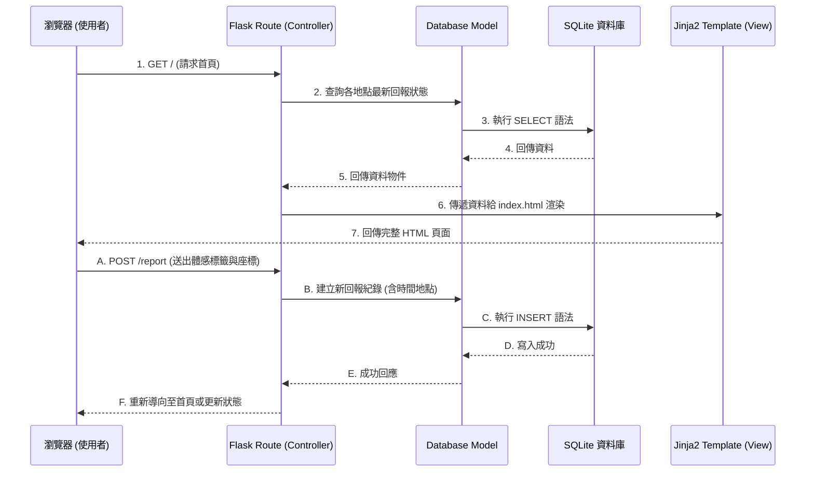

# 系統架構設計 (ARCHITECTURE)

## 專案名稱
校園設施體感地圖

---

## 1. 技術架構說明

### 選用技術與原因
- **後端框架：Python + Flask**
  - **原因**：Flask 是輕量級的網頁框架，非常適合打造 MVP（最小可行性產品）與微型服務。本專案核心需求為快速寫入與讀取地點狀態，使用 Flask 能以最少程式碼快速建立路由與邏輯。
- **模板引擎：Jinja2**
  - **原因**：與 Flask 高度整合，支援伺服器端渲染 (SSR)。本專案不需複雜的前端框架（如 React/Vue），由 Jinja2 直接產生 HTML 頁面，不僅降低開發門檻，也確保頁面載入速度。
- **資料庫：SQLite**
  - **原因**：輕量、無需額外架設資料庫伺服器。資料直接儲存於單一檔案中，適合初期資料量不大、且主要處理讀寫頻率中等情境的校園應用。

### Flask MVC 模式說明
儘管 Flask 本身不強迫使用特定架構，本專案將採用類似 MVC（Model-View-Controller）的模式進行開發，以確保程式碼的可維護性：
- **Model（模型）**：定義 SQLite 資料表結構，處理與資料庫的溝通（如儲存新的體感回報、查詢歷史紀錄）。
- **View（視圖）**：Jinja2 HTML 模板與前端靜態資源（CSS/JS），負責呈現即時狀態清單與回報介面給使用者。
- **Controller（控制器）**：Flask 的路由（Routes），負責接收使用者請求（例如點擊回報按鈕）、呼叫 Model 處理資料，最後將結果與資料傳遞給 View 進行渲染。

---

## 2. 專案資料夾結構

本專案依循模組化設計，將路由、模型與模板分離：

```text
campus_sensory_map/
│
├── app/                      # 主要應用程式資料夾
│   ├── __init__.py           # Flask App 初始化設定
│   ├── models/               # 資料庫模型 (Model)
│   │   ├── __init__.py
│   │   ├── location.py       # 地點相關資料模型
│   │   └── report.py         # 體感回報紀錄模型
│   ├── routes/               # Flask 路由 (Controller)
│   │   ├── __init__.py
│   │   ├── main_routes.py    # 主頁、地圖瀏覽相關路由
│   │   └── api_routes.py     # 處理回報送出等 API 邏輯
│   ├── templates/            # Jinja2 HTML 模板 (View)
│   │   ├── base.html         # 共用版型（Header, Footer）
│   │   ├── index.html        # 首頁（地圖/狀態清單）
│   │   └── dashboard.html    # 管理員數據看板
│   └── static/               # CSS / JS 靜態資源
│       ├── css/
│       │   └── style.css
│       ├── js/
│       │   └── main.js       # 處理自動定位、三秒回報邏輯
│       └── img/
│
├── instance/                 # 放置不進入版控的環境變數或資料庫
│   └── database.db           # SQLite 資料庫檔案
│
├── docs/                     # 專案說明文件
│   ├── PRD.md                # 產品需求文件
│   └── ARCHITECTURE.md       # 系統架構文件 (本文件)
│
├── requirements.txt          # Python 依賴套件清單
├── .gitignore                # Git 忽略設定
└── app.py                    # 專案啟動入口檔案
```

---

## 3. 元件關係圖

以下展示使用者與系統互動時，各元件間的資料流向關係：



---

## 4. 關鍵設計決策

1. **不採用前後端分離架構**
   - **原因**：為了加速 MVP 開發，我們決定讓 Flask 統包後端邏輯與畫面渲染（SSR）。相較於建立一套獨立的 RESTful API 與獨立的 React 專案，Jinja2 讓資料能直接在頁面上顯示，減少跨來源請求 (CORS) 與狀態管理的複雜度。
2. **地理位置 (Geolocation) 獲取交由前端處理**
   - **原因**：使用者的確切經緯度必須由瀏覽器透過 `navigator.geolocation` API 取得並經過使用者同意。因此，回報按鈕點擊後，會先由前端 JS 獲取位置，再將資料與標籤一併以 POST 發送給後端。
3. **輕量級的防刷機制**
   - **原因**：為了防止惡意灌水，系統需記錄使用者的回報行為。初期為了降低使用門檻，我們不強制要求註冊登入，而是使用 Session 或 Cookie 來標記使用者，結合後端邏輯限制「同一使用者 5 分鐘內不可對同一地點重複回報」。
4. **狀態時效性的實作方式**
   - **原因**：為了確保資訊的「即時性」，資料庫會完整記錄每筆回報的時間戳記（Timestamp）。在查詢狀態時，後端只抓取特定時間內（如 1 小時內）的回報資料，或在前端顯示時計算「X 分鐘前」，以確保過時的資訊不會誤導使用者。
