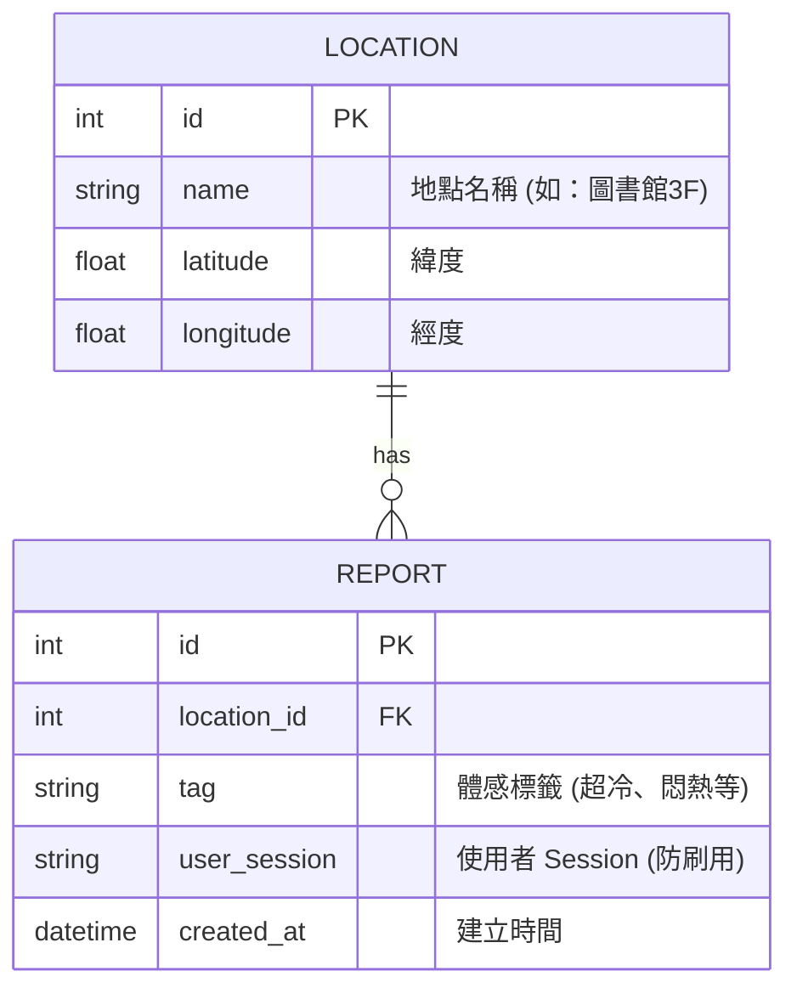

# 資料庫設計 (DB DESIGN)

## 1. ER 圖（實體關係圖）

## 2. 資料表詳細說明

### `locations` (地點資料表)
儲存校園內的主要地點與其經緯度資訊。
- `id` (INTEGER) : Primary Key, 自動遞增。
- `name` (TEXT) : 地點名稱（如「圖書館 3 樓」、「綜合教學大樓」），必填。
- `latitude` (REAL) : 緯度，供地圖顯示與距離計算，可選。
- `longitude` (REAL) : 經度，供地圖顯示與距離計算，可選。

### `reports` (體感回報資料表)
儲存使用者的即時體感回報紀錄。
- `id` (INTEGER) : Primary Key, 自動遞增。
- `location_id` (INTEGER) : Foreign Key，對應 `locations.id`，必填。
- `tag` (TEXT) : 體感標籤（超冷、悶熱、爆滿、空曠等），必填。
- `user_session` (TEXT) : 使用者識別碼（如 Cookie/Session ID），用於防止同一使用者短時間內重複回報，必填。
- `created_at` (DATETIME) : 回報送出的時間戳記，預設為 `CURRENT_TIMESTAMP`（UTC 時間），必填。

## 3. SQL 建表語法
完整的建表 SQL 語法位於 `database/schema.sql`。

## 4. Python Model 程式碼
依據系統架構，我們使用 Python 內建的 `sqlite3` 模組來操作 SQLite 資料庫。
- **`app/models/db.py`**：處理資料庫連線與初始化建表。
- **`app/models/location.py`**：處理 `locations` 資料表的 CRUD 方法。
- **`app/models/report.py`**：處理 `reports` 資料表的 CRUD 方法與防刷驗證。
