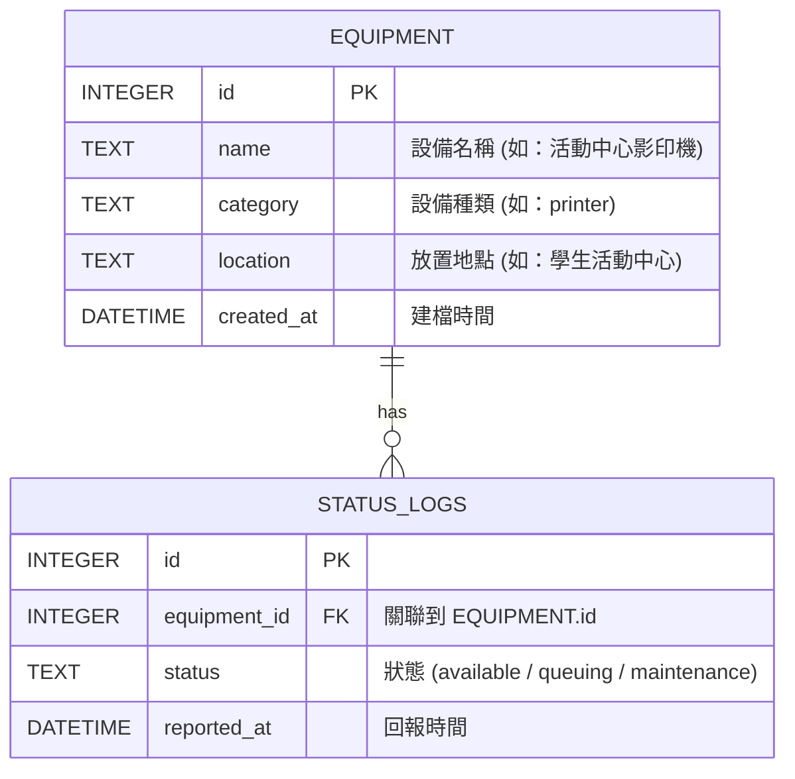

# 資料庫設計文件 (DB Design)：校園設施體感地圖

## 1. ER 圖（實體關係圖）

本專案將資料切分為「設備基本資訊」與「設備狀態紀錄」兩張表，以支援即時狀態查詢與後續的歷史統計分析。兩張表為**一對多 (1:N)** 的關係。

---

## 2. 資料表詳細說明

### 2.1 `equipment` (設備資料表)
存放校園內設備的靜態資訊。

| 欄位名稱 | 型別 | 屬性 | 說明 |
| -------- | ---- | ---- | ---- |
| `id` | INTEGER | PK, AUTOINCREMENT | 設備唯一識別碼 |
| `name` | TEXT | NOT NULL | 設備顯示名稱 |
| `category` | TEXT | NOT NULL | 設備種類標籤（例如 `printer`, `water_dispenser`, `computer`），用於分類篩選 |
| `location` | TEXT | | 設備放置地點（選填，方便使用者辨識） |
| `created_at` | DATETIME | DEFAULT CURRENT_TIMESTAMP | 設備建檔時間 |

### 2.2 `status_logs` (設備狀態紀錄表)
存放使用者回報的設備動態狀態，每一筆回報都是一條獨立紀錄。要取得某設備的「最新狀態」，只需查詢該設備在時間上最新的一筆紀錄即可。

| 欄位名稱 | 型別 | 屬性 | 說明 |
| -------- | ---- | ---- | ---- |
| `id` | INTEGER | PK, AUTOINCREMENT | 紀錄唯一識別碼 |
| `equipment_id` | INTEGER | FK, NOT NULL | 關聯到 `equipment` 表的 `id` |
| `status` | TEXT | NOT NULL | 狀態值，限定為：`available` (可用), `queuing` (排隊中), `maintenance` (維修中) |
| `reported_at`| DATETIME | DEFAULT CURRENT_TIMESTAMP | 紀錄回報當下的時間 |

> **設計決策**：
> 如 PRD 與架構文件所述，我們不需要在 `equipment` 裡新增 `current_status` 欄位。所有的狀態都來自 `status_logs`，並搭配「30 分鐘自動失效」的邏輯。若設備無紀錄或最新紀錄超過 30 分鐘，系統皆視為預設的 `available`。

---

## 3. SQL 建表語法

請參考 `database/schema.sql`。

---

## 4. Python Model 程式碼

依照輕量化與降低學習門檻的原則，我們採用 Python 內建的 `sqlite3` 模組撰寫 Data Access Object (DAO) 模式的 Model。
程式碼存放在 `app/models/` 目錄中：
- `app/models/db.py`: 負責資料庫連線與初始化設定。
- `app/models/equipment.py`: 提供設備的 CRUD 與包含最新狀態的查詢。
- `app/models/status_log.py`: 提供狀態紀錄的 CRUD。
