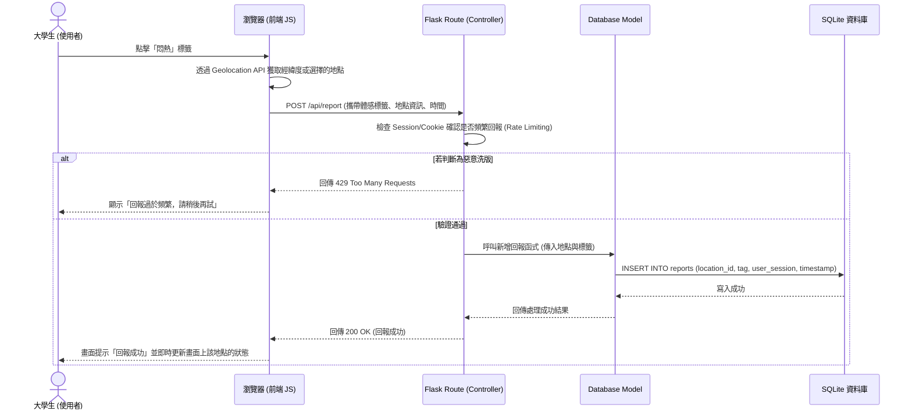

# 系統流程圖 (FLOWCHART)

## 1. 使用者流程圖（User Flow）
此流程圖描述大學生從進入系統到完成體感回報的直覺操作路徑。

```mermaid
flowchart LR
    Start([使用者開啟網頁]) --> Home[首頁 - 體感地圖與狀態清單]
    Home --> Decision{要執行什麼操作？}
    
    Decision -->|查看各地點狀態| View[瀏覽地圖與各區體感標籤]
    View --> Home
    
    Decision -->|進行回報| Report[點擊回報按鈕]
    Report --> CheckLoc{是否允許瀏覽器獲取定位？}
    CheckLoc -->|拒絕/失敗| Manual[提供常見地點下拉選單供手動選擇]
    CheckLoc -->|允許| AutoLoc[自動帶入使用者目前所在位置]
    
    Manual --> SelectTag[點擊體感標籤 (如：超冷、悶熱、爆滿、空曠)]
    AutoLoc --> SelectTag
    
    SelectTag --> Submit[前端發送回報資料]
    Submit --> Success([顯示回報成功，更新首頁資訊])
```

## 2. 系統序列圖（Sequence Diagram）
此序列圖展示使用者送出「體感回報」時，系統前後端與資料庫的完整互動與資料流。



## 3. 功能清單對照表
列出系統主要功能及其對應的 URL 路徑與 HTTP 方法。

| 功能名稱 | URL 路徑 | HTTP 方法 | 說明 |
| :--- | :--- | :--- | :--- |
| 首頁 (地圖與狀態列表) | `/` | `GET` | 透過 Jinja2 渲染主畫面與各地點最新回報狀態 |
| 送出體感回報 | `/api/report` | `POST` | 接收前端傳來的體感標籤與座標/地點，驗證後寫入資料庫 |
| 獲取最新狀態 (供前端更新) | `/api/locations` | `GET` | 供前端非同步 (AJAX/Fetch) 更新地圖標記或列表狀態 |
| 管理員數據看板 | `/admin/dashboard` | `GET` | 透過 Jinja2 渲染歷史回報數據統計分析圖表 |
