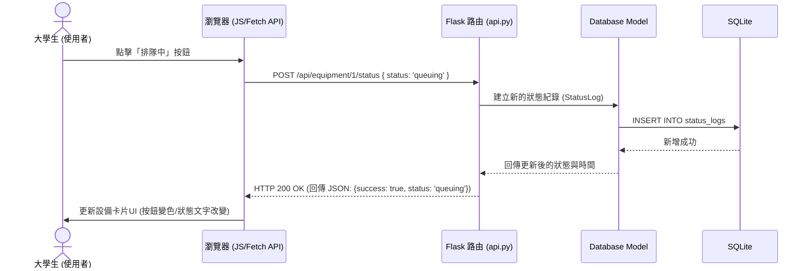

# 流程圖與路由對照文件 (Flowchart)：校園設施體感地圖

本文件描述了使用者的操作流程（User Flow）、系統回報狀態的詳細資料流（Sequence Diagram），以及對應的路由端點清單。

## 1. 使用者流程圖 (User Flow)

描述使用者進入網站後，可能進行的各種操作路徑，包含瀏覽、篩選以及狀態回報。

```mermaid
flowchart LR
    Start([進入網站]) --> Home[首頁 - 設備狀態列表]
    
    Home --> Action{要執行什麼操作？}
    
    %% 篩選路徑
    Action -->|選擇篩選條件| Filter[點擊設備分類\n(如：只看飲水機)]
    Filter --> Home
    
    %% 回報路徑
    Action -->|到達現場| Report[點擊特定設備的「更新狀態」]
    Report --> SelectStatus[選擇：可用 / 排隊中 / 維修中]
    SelectStatus --> Submit[送出標註]
    Submit --> UpdateUI[畫面上即時更新為最新狀態]
    UpdateUI --> Home
    
    %% 管理員路徑
    Action -->|管理員登入/訪問| Admin[進入後台統計儀表板]
    Admin --> ViewStats[查看設備故障與排隊統計圖表]
```

---

## 2. 系統序列圖 (Sequence Diagram)：狀態回報流程

描述當使用者點擊「送出標註」時，背後的資料流如何從前端傳遞到後端 Flask，最後寫入 SQLite 資料庫並完成畫面更新。我們採用 AJAX 非同步請求，讓使用者不需重新載入頁面即可看到狀態變更。



---

## 3. 功能清單與路由對照表

以下是本專案主要功能對應的 URL 路徑與 HTTP 方法，供後續實作 API 路由時參考：

| 功能名稱 | 說明 | HTTP 方法 | URL 路徑 |
| -------- | ---- | --------- | -------- |
| **首頁與設備列表** | 顯示所有設備的當前狀態 | `GET` | `/` |
| **設備分類篩選** | 透過 Query String 進行篩選（例如 `/?category=printer`） | `GET` | `/` |
| **回報設備狀態** | 透過 AJAX 提交新的狀態標註 | `POST` | `/api/equipment/<int:equipment_id>/status` |
| **後台儀表板** | 管理員查看歷史狀態統計圖表或報表 | `GET` | `/admin` |

> **開發提示**：
> - 針對 `/api/equipment/<id>/status` 的 POST 請求，前端預計會傳送包含 `status` 欄位（`available`, `queuing`, `maintenance`）的 JSON 格式資料。
> - 在 MVP 階段，後台 `/admin` 可先做成隱藏網址或簡易版不需登入即可查看的頁面，後續若有需要再補上簡單的密碼驗證。
